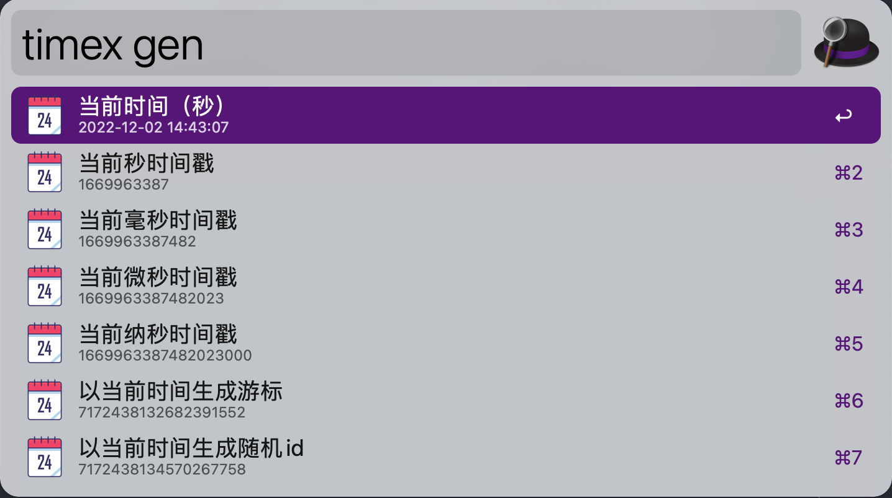

# Alfred Utils

程序员的工作中总是有些重复的工作，很多时候可以借助现有工具解决，但是每次都要打开浏览器，搜索，找到对应的工具，再进行操作，这样的效率太低了，所以我写了这个工具，可以在 Alfred 中直接调用，省去了打开浏览器的时间。

典型的，像生成时间戳，我可以有多种解法，但都不够快。

1. 打开 ide，写一个生成时间戳的单测，运行下；
2. 打开浏览器，搜索时间戳，找到站长工具，复制下当前时间戳；

其实，生成时间戳单测是可复用的，我可以打开 ide，找到之前的单测，再跑一下。不过打开 ide 的动作也是重的，有时 ide 冷启动要几十秒。
alfred utils 相当于将这个可复用的单测放到了 alfred 里，借助 alfred 强大的搜索能力，搜索到需要执行的工具，运行即可得出结果，回车可以将对应行的结果复制到剪切板。

# 后续

未来我准备将自己觉得很麻烦的一些小功能也做成 Alfred Tools，慢慢的加入到这个项目中。

# 版权

本项目仅个人学习使用，其他人不可用于商业用途，不保证代码完全无 bug，同时也不保证一定会及时修 bug。